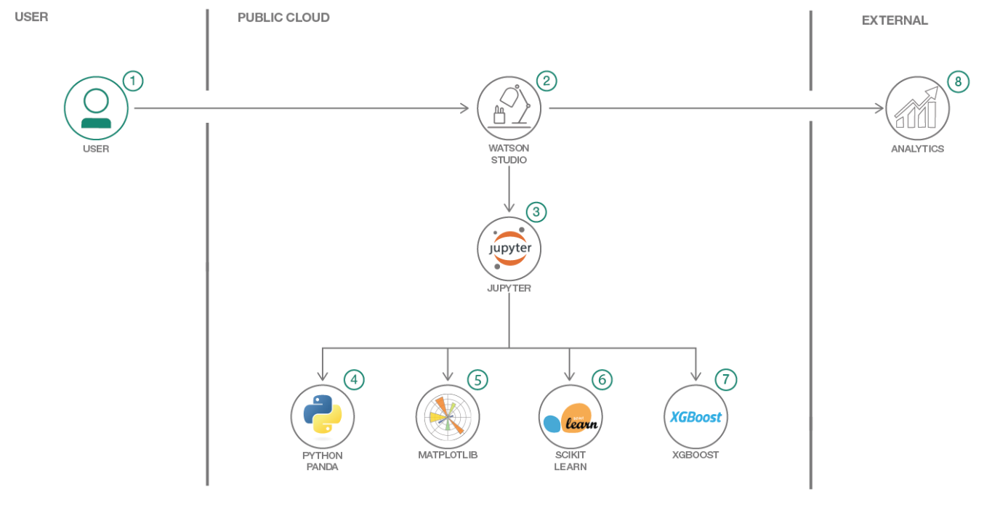
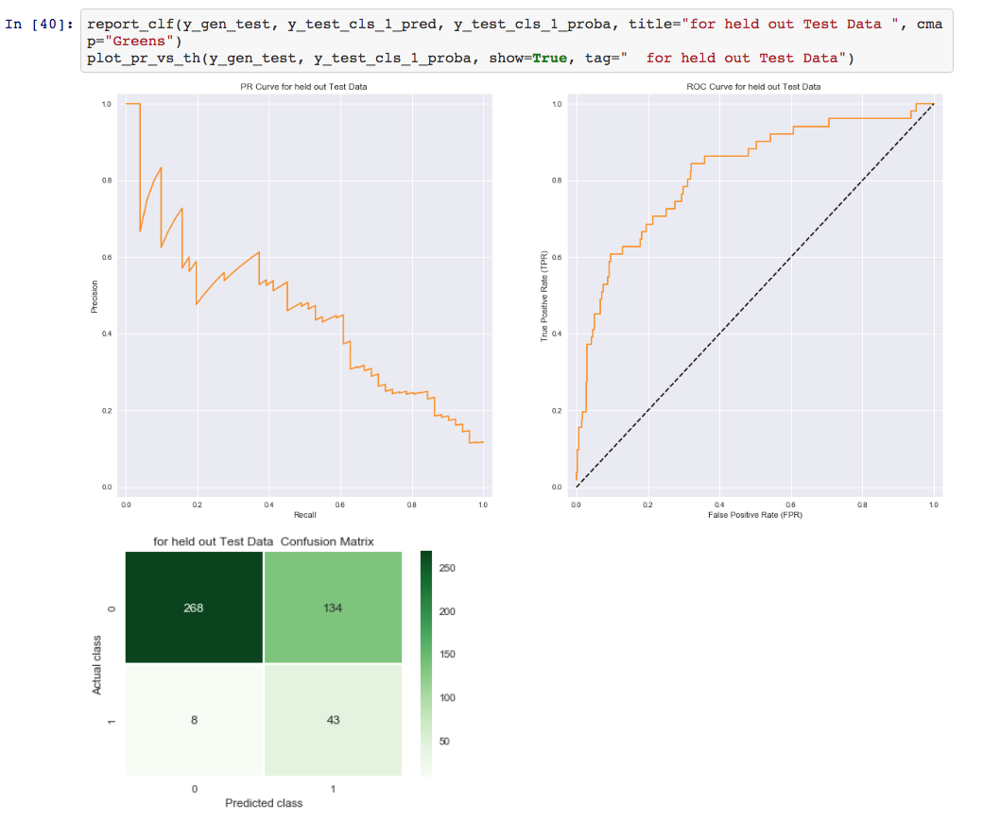
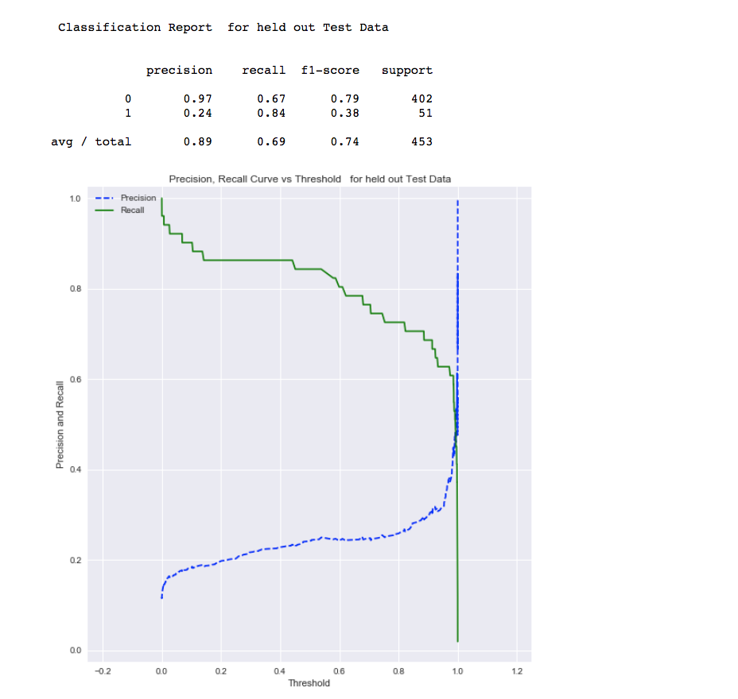

# Using XGBoost for Predicting Bank Clients' Product Subscriptions in Imbalanced Data.

 XGBoost (Extreme Gradient Boosting Decision Tree) is very common tool for creating the Machine Learning Models for classification and regression. However, there are various tricks and techniques for creating good classification models using XGBoost for imbalanced data-sets that is non-trivial and the reason for developing this Code Pattern.

In this Code Pattern, we will illustrate how the Machine Learning classification is performed using XGBoost, which is usually a better choice compared to logistic regression and other techniques. We will use a real life data set which is highly imbalanced (i.e the number of positive sample is much less than the number of negative samples).

This Code Pattern will walk the user through the following conceptual steps:

* Data Set Description.
* Exploratory Analysis to understand the data.
* Use various preprocessing to clean and prepare the data.
* Use naive XGBoost to run the classification.
  * Use cross validation to get the model.
  * Plot, precision recall curve and ROC curve.
* We will then tune it and use weighted positive samples to improve classification performance.
* We will also talk about the following advanced techniques.
  * Oversampling of majority class and Undersampling of minority class.
  * SMOTE algorithms.

#### Notebooks

We have notebook 'predict_bank_cd_subs_by_xgboost_clf_for_imbalance_dataset.ipynb' for this.

## Flow

## Featured technologies

* Data Science, Python, XGBoost, Scikit Learn, Pandas, Matplotlib, SeaBorn

#### 1. Upload data

* This project uses the dataset in [data/bank.csv](data/bank.csv). We need to load this asset to our project.

* A panel on the right of the screen will appear to assit you in uploading data. Follow the numbered steps in the image below.

#### 2. Run the notebook

* Click the `(►) Run` button to start stepping through the notebook.

* Stop at the `Data Exploration` section.

### Explore, Analyze and Predict CD Subscription for Bank Client

#### 1. Explore the dataset

The imbalanced dataset is from Portuguese banking institutions, and is based on phone calls to bank clients regarding the purchase of financial products offered by the bank (ie. Certificates of Deposit).

#### 2. Prepare the data

For this section we will mostly use Python based libraries such as XGBoost, Scikit-learn, Matplotlib, SeaBorn, and Pandas.

#### 3. Visual Data Exploration to understand the data using Seaborn and Matplotlib

Data scientists typically perform data exploration to gain better insight into data. Here we will explore inputs for distribution, correlation and outliers, and outputs to note any class imbalance issues.

#### 4. Create Scikit learn ML Pipelines for Data Processing

* Split the data into train and test sets.
* Create an ML pipeline for data preparation.

In typical machine learning applications, an ML pipeline is created so that all the steps that are done on a training data set can be easily applied to the test set.

#### 5. Model Training and evaluation

Model Training is a iterative process and we will do several iterations to improve our model performance.

Using XGBoost as our tool of choice, we will highlight classification performance metrics such as ROC curve, Precision-Recall curve, and Confusion Matrix.

## Sample Output

The following screen-shots show that we set the weight on the positive sample to be 1000 and the feature selection threshold to be 0.008. In the third attempt running this tuned classifier, we find that our recall for an imbalanced positive sample has improved to 0.84 on the test data.

Awesome job following along! Now go try and take this further or apply it to a different use case!

## Links

* [Data Set](https://archive.ics.uci.edu/ml/datasets/Bank+Marketing)

